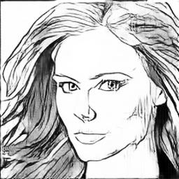

# CartoonizedGanExport

[https://applicable-ml.github.io/cartoonize_gan_api/](https://applicable-ml.github.io/cartoonize_gan_api/) 에 해당 내용을 정리해두었습니다

`cycle gan` 을 기반으로 학습한 모델을 (`현실 -> 흑백 만화체`) 대상으로
원본 레포가 너무나 많아, 필요한 부분만 추출하고,  
그 중에서도 `torch jit` 를 통해서 필요로한 부분만 추출하는 방법을 정리해놓은 Repo 입니다. 

- [원본 레포](https://github.com/junyanz/pytorch-CycleGAN-and-pix2pix)

----

### Require Environment

아래 라이브러리 정도만 필요로하니, 쉽게 환경을 구축하실 수 있으실 겁니다.  
굳이 아래 설정과 버젼까지 동일할 필요는 없으며, 이케저케 해서 실행을 하실 수 있으실 겁니다.

```
Pillow==7.1.2
torch==1.10.0
torchvision==0.11.1
```


-----

#### 파일 설명

- `inference.py`

  sample 이미지를 대상으로 결과물을 출력합니다.

- `jit_export.py`

  학습된 모델을 JIT 로 Export 합니다.

- `jit_test.py`

  jit 로 export 된 모델을 테스트합니다.


-----

#### Result 비교

|원본|CartoonizeGan 적용후|
|------|---|
|||

#### Taken Time 비교

 CPU 환경에서, 100 번의 연산 결과를 기반으로, 평균을 구하였으며, 

JIT 적용으로 인한 속도 향상은 크게 상관은 없는 듯합니다. 

| JIT 적용 전 | JIT 적용 후 |
| ----------- | ----------- |
| 1.072       | 1.049       |


------


